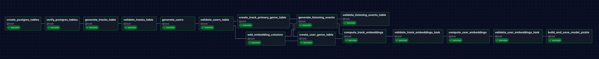
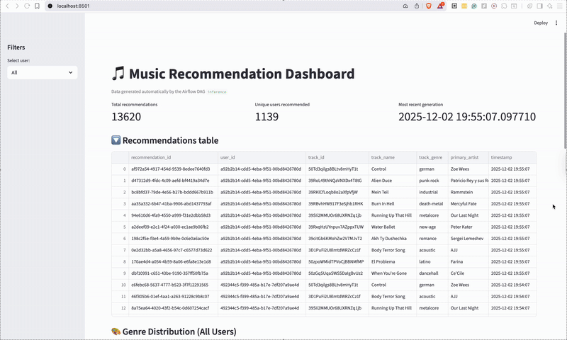
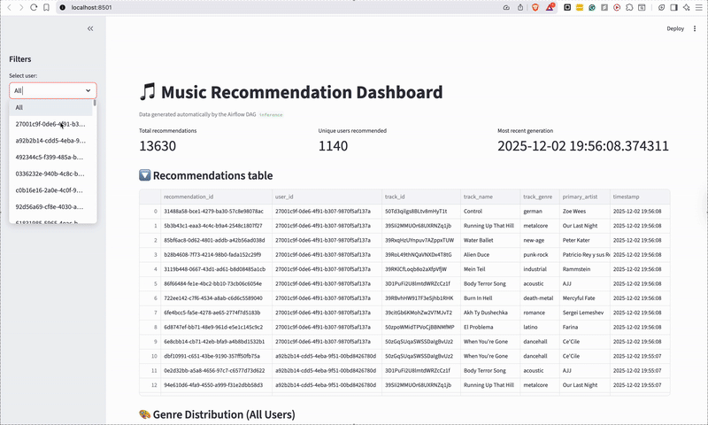
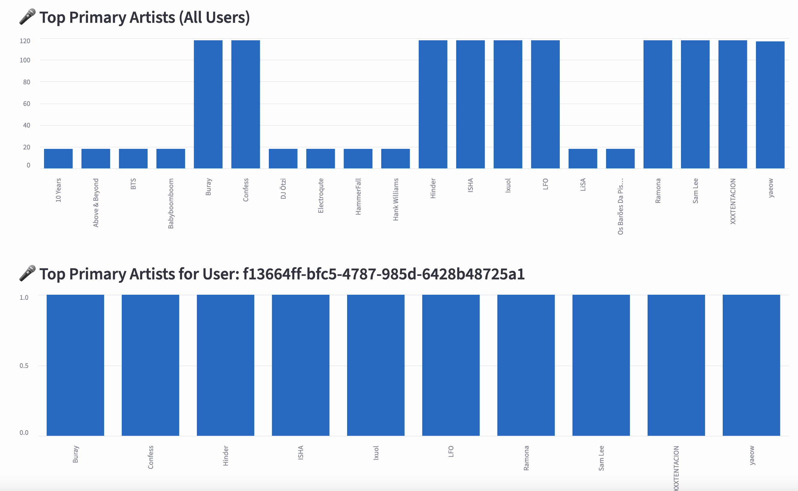
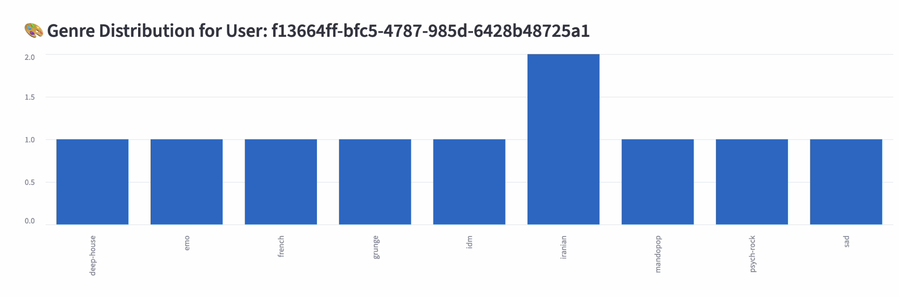
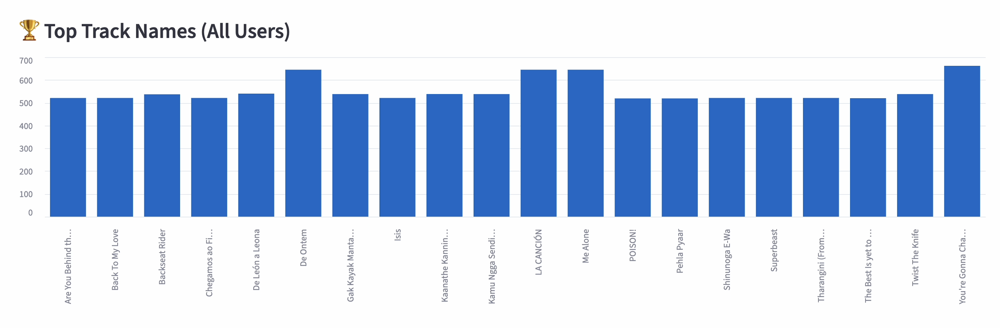
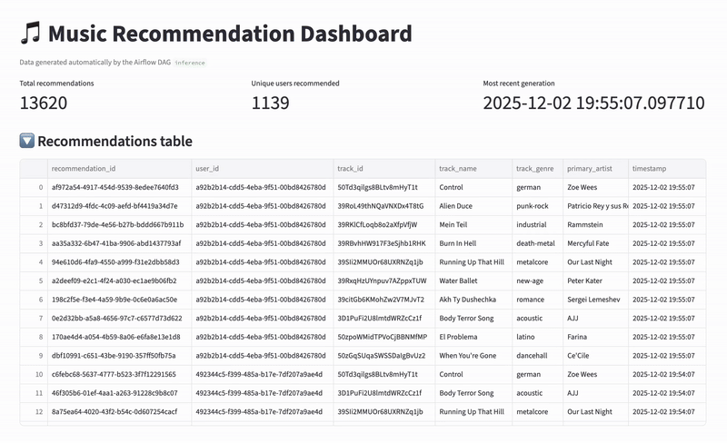

# [Sparkify Music Recommendation Pipeline](https://www.youtube.com/watch?v=6mdhQYfkFKo)
A full end-to-end data engineering + machine learning system that ingests track metadata, generates synthetic user listening activity, builds a content-based recommendation model, runs scheduled Airflow DAGs to update embeddings and recommendations, and serves results to a Streamlit dashboard.

## Project Overview  
This project builds a production-style music recommendation pipeline that combines:

- **Kaggle track dataset**  
- **Synthetic users + listening event generator**  
- **Content-based recommendation model**  
- **Postgres warehouse**  
- **Airflow orchestration**  
- **Streamlit dashboard**  
- **Automated tests + CI/CD**

The goal is to simulate the infrastructure of a real music analytics platform (“Sparkify”) where new listening activity and track data continuously flow through an ETL + ML pipeline, producing fresh recommendations for every user.

## Dataset Background

The song metadata for this project is based on the public [Spotify Tracks Dataset](https://www.kaggle.com/datasets/maharshipandya/-spotify-tracks-dataset) found on Kaggle. This dataset provides a large collection of tracks along with audio features, making it well-suited for building embeddings and powering a recommendation pipeline. This dataset contains about 114,000 rows, where each row represents a single song.

### Dataset Contents

Each row represents one Spotify track, including:
- Track identifiers (id number)
- Artists
- Album name 
- Genre
- Popularity scores
- Audio features (danceability, energy, instrumentalness, etc)
- Timing and rhythm information (tempo, time signature, duration)

These features allow us to build realistic track embeddings and support downstream recommendation logic.

## Introduction / Exploratory Data Analysis (EDA)  
EDA notebooks (`00_eda.ipynb` and `03_eda.ipynb`) explore the structure and quality of the raw Kaggle track dataset.

**Highlights from the EDA:**
- Visualized distribution of genres, artists, and track metadata.  
- Inspected numeric audio features such as:
  - energy  
  - valence  
  - danceability  
  - loudness  
  - speechiness  
  - acousticness  
- Investigated correlations between features and potential data leakage.  
- Identified missing values, inconsistent types, and outliers.  
- Confirmed suitability of audio features for content-based similarity modeling.

The EDA step establishes which features are reliable inputs to the recommendation model.

## Data Cleaning  
The cleaning notebook (`02_clean_data.ipynb`) transforms the raw dataset into a modeling-ready format.

**Key Cleaning Steps:**
- Dropping unused or redundant columns.  
- Filling or removing missing numeric feature values.  
- Ensuring each track has a unique `track_id`.  
- Normalizing audio features for later vector-based similarity computation.  
- Validating column types and ensuring genre/artist consistency.  
- Exporting cleaned data to CSV for loading into Postgres.

The cleaned dataset becomes the starting point for downstream Airflow DAGs.

## Airflow DAGs Overview

This project uses two Airflow DAGs to power the full recommendation system pipeline:  
1. **`ingestion_embeddings`** – builds all backend data + embeddings  
2. **`inference`** – generates real-time recommendations

Both DAGs run inside the Airflow environment and share the same Postgres database + model artifacts.

---

### 1. `ingestion_embeddings` DAG  
#### *Offline Data Pipeline — Build the Warehouse + Embeddings + Model Artifact*

This DAG is responsible for **building the entire analytics foundation** of the project.  
It loads and validates the raw track dataset, creates synthetic users and listening events, computes embeddings, and produces the model artifact used by the inference DAG.

#### Overview of DAG
- **Creates all required Postgres tables** for tracks, users, listening events, and genres.  
- **Ingests the cleaned Spotify track dataset** into the warehouse.  
- **Generates synthetic users** with realistic music preferences.  
- **Simulates listening behavior** to create a rich event history.  
- **Computes embeddings**:
  - Track embeddings (using PCA-based feature transformations)
  - User embeddings (genre-weighted vectors)  
- **Builds and saves a model artifact** that contains:
  - The track embedding matrix  
  - User embedding vectors  
  - Track metadata  
- **Validates each step** (data quality checks, schema checks, embedding checks).  

#### Purpose of DAG
This pipeline creates **everything the recommendation engine needs**:
- A structured database  
- High-quality feature representations  
- Embeddings for vector similarity search  
- A reusable model file that downstream pipelines can load instantly  

This DAG exists as the *data backbone* of the project.



---

### 2. `inference` DAG  
#### *Online Recommendations — Generate Top-K Tracks Continuously*

This DAG uses the artifacts created by `ingestion_embeddings` to produce real-time recommendations for users.

#### Overview of DAG
- **Creates a recommendations table** in Postgres if it doesn’t exist.  
- **Loads the model artifact** saved by the ingestion DAG.  
- **Selects a user** and retrieves their listening history.  
- **Computes recommendation scores** using cosine similarity between:
  - the user’s embedding  
  - all track embeddings  
- **Filters out tracks the user already listened to**.  
- **Stores the top-K recommendations** in the warehouse.  
- Runs **every minute**, continually generating new recommendations.

#### Purpose of DAG
This pipeline actively produces recommendations using the latest user and track embeddings.  
It simulates how a real recommendation engine would operate in production:  
- lightweight  
- fast  
- scheduled  
- always using the most recent embeddings and data  


---

###  How the Two DAGs Work Together

| DAG | Role | Output → Input |
|-----|------|----------------|
| **`ingestion_embeddings`** | Offline ETL + modeling | Produces the model artifact + embeddings |
| **`inference`** | Online recommendation engine | Loads the artifact + embeddings to generate recs |

Together, they create a full end-to-end system:

**Data → Features → Embeddings → Model → Recommendations**

## Dashboard (Streamlit)  
`streamlit_app.py` provides an interactive front-end to explore recommendations.

### **Features**
- Dropdown sidebar to select a user.  
- Real-time query to the inference script.  
- Table of:
  - recommended tracks  
  - relevant metadata  
- Auto-refresh for live updates.  
- Uses Postgres + dotenv for environment configuration.

The dashboard demonstrates how analysts or product managers would consume the pipeline’s output.

# Dashboard Visualizations  

The Streamlit dashboard provides an interactive interface for exploring recommendations generated by the Airflow pipelines. It surfaces several insights about **global listening trends**, **individual user behavior**, and the **final recommendation outputs** stored in Postgres. These visualizations demonstrate how model outputs are consumed and interpreted by analysts or product managers.

---
## Global Dashboard View 


## Per User Dashboard View


## 🎤 Top Primary Artists (All Users & Per User)



This chart summarizes the **most frequently listened-to primary artists across all synthetic users**.  
It aggregates listening events and counts how many times each artist appears as the primary artist for a played track.

**What this view shows:**

- Global popularity patterns across the entire user base  
- Which artists dominate listening behavior  
- Whether listening patterns are balanced or skewed toward certain artists  

Below the global chart is a **per-user version** that shows the top primary artists for a selected user. This makes it easy to compare:

- Individual user preferences  
- Alignment (or misalignment) with global popularity  

---

## Genre Distribution (Per User)



This visualization shows the **genre distribution for a selected user**, based on their listening history.  
Each bar represents how many tracks from each genre the user has consumed.

**What this view shows:**

- Dominant genres in the user's listening behavior  
- Whether users have diverse or concentrated music tastes  
- How genre preferences influence user embeddings  
- Which genres are likely to shape future recommendations  

Genre-level insights help validate that the recommendation engine produces results consistent with user preferences.

---

## Top Track Names (All Users)


This represents the most frequently played tracks in the synthetic dataset.

**What this view shows:**

- Global track-level popularity  
- Whether tracks correlate with top artists and genres  
- Skew or imbalance in listening behaviors  
- How track popularity may affect recommendation scoring  

This helps provide context for why certain tracks appear frequently in recommendations.

---

## Full Recommendations Table



The dashboard includes a **Recommendations Table** that displays the results of the Airflow `inference` DAG.  
This table is a direct view of the `user_recommendations` table stored in Postgres and refreshed automatically.

Each row includes:

- `recommendation_id` — unique identifier  
- `user_id` — user receiving the recommendation  
- `track_id` — recommended track  
- `track_name` — name of the track  
- `track_genre` — genre of the track  
- `primary_artist` — primary associated artist  
- `timestamp` — when the recommendation was generated  

**Why this table matters:**

- Validates that the recommendation engine is producing outputs on schedule  
- Shows the total number of recommendations and unique users served  
- Provides the timestamp of the most recent Airflow run  
- Allows inspection of recommendation quality and diversity  

This table represents the final stage of the pipeline—where embedded features, user vectors, and similarity-based ranking become actionable recommendations.

---


# Testing

Our pipeline uses a **two-layer testing strategy** designed for data engineering workflows:  
(1) fast Python logic tests that run in CI, and  
(2) runtime validation tasks embedded directly in Airflow to ensure end-to-end data quality.

---

## 1. Python Simulation Tests (Logic-Level)

All Python tests live under:

```
tests/
├── conftest.py
├── test_database_operations.py
├── test_inference_operations.py
├── test_recommendation_model.py
└── test_integration_edge_cases.py
```

These tests **do not call Airflow tasks**. Instead, they simulate core pipeline logic using small, controlled pandas DataFrames and numpy vectors.

### These tests cover:
- database operation behavior (mocked connections, schema expectations)  
- recommendation logic (cosine similarity, ranking, filtering listened tracks)  
- inference logic (pickle loading, embedding math, missing-user edge cases)  
- boundary conditions and failure cases (empty histories, malformed embeddings)  
- shared fixtures for consistent, deterministic test data

### Testing Locally:
```
# run full suite
pytest tests/ -v
```

Convenience
-----------
- `./run_tests.sh` — helper script for common runs (unit/integration/coverage/lint)
- `Makefile` — targets `make test`, `make test-unit`, `make coverage`, `make lint`, etc.

---

## 2. Airflow DAG Validation Tasks (Runtime Data Quality)

In addition to Python tests, each major DAG includes **explicit validation tasks** that run every time the pipeline executes.

Validation logic exists in:

```
dags/model_pipeline/ingestion_embeddings.py
dags/model_pipeline/inference.py
```

### These validators enforce:
- required Postgres tables exist and contain rows  
- tracks/users/events tables have correct schema and no duplicate IDs  
- track and user embeddings are non-null and correctly formatted  
- the model pickle contains expected structures (`user_map`, `track_matrix`, `track_meta`)  
- generated recommendations contain valid fields and non-negative scores  

### Why:
These checks protect the *live* pipeline from corrupted tables, malformed embeddings, broken pickle artifacts, or invalid recommendation output—issues that cannot be detected by offline tests alone.

---

## 3. How Both Layers Work Together

| Layer | Validates | Runs In | Purpose |
|-------|-----------|---------|---------|
| **Python Simulation Tests** | Logic and model behavior | Local / CI | Fast, isolated verification of core functions |
| **Airflow Validation Tasks** | Real data, Postgres state, embeddings, pickle integrity | Airflow runtime | Prevents invalid data from entering production tables |

This hybrid approach ensures both **functional correctness** and **pipeline reliability** without the overhead of executing full DAGs in CI.

# GitHub Actions CI/CD Workflow
[](https://github.com/ammylin/DE-Final-Project-Sparkify/actions/workflows/ci-cd-tests.yml)

The project uses **GitHub Actions** to automatically run tests, linting, and security checks on every push or pull request to `main` or `develop`. The workflow ensures stability, code quality, and early detection of issues.

The pipeline includes four jobs: **tests**, **lint**, **security**, and **build-status**.

---

## 1. Test Job — Unit Tests & Coverage

Runs the core validation for the recommendation logic, synthetic data functions, and DAG utilities.

**Steps performed:**
- Install dependencies  
- Run `flake8` for syntax checks  
- Execute unit tests:

```bash
pytest tests/ -v --tb=short --ignore=tests/test_integration_edge_cases.py
```

- Generate coverage reports  
- Upload results to Codecov  

**Purpose:** ensure that core logic remains correct and regression-free.

---

## 2. Lint Job — Formatting & Static Analysis

Runs style and formatting tools:

- **isort** for import ordering  
- **black** for formatting  
- **pylint** for static analysis  

Lint errors do **not** block merges (`continue-on-error: true`) but provide useful feedback.

---

## 3. Security Job — Vulnerability Checks

Uses:

- **Bandit** to scan Python code  
- **Safety** to check dependencies  

Findings surface security issues without blocking development.

---

## 4. Build Status Job

Runs after testing and marks the overall workflow as pass/fail based on the test results.

---

## Why It Matters

- Prevents logic regressions  
- Ensures consistent, high-quality code  
- Surfaces security risks early  
- Keeps the development workflow stable and reliable  

This CI/CD pipeline provides automated assurance that every commit maintains the integrity of the project.


## Limitations & Future Work  

### **Current Limitations**
- The recommendation model is purely content-based and does not incorporate:
  - collaborative filtering  
  - temporal patterns  
  - user session behaviors  
- Synthetic listening data may not fully represent real-world behavior.  
- No deduplication or advanced validation yet in Airflow DAGs.  
- Inference is synchronous and not optimized for large user populations.  
- Feature engineering does not yet include embeddings learned from deep models.

### **Future Improvements**
- Integrate **collaborative filtering** or **hybrid models**.  
- Add real-time streaming ingestion with Kafka/Kinesis.  
- Expand synthetic generator to simulate:
  - session length  
  - skip behavior  
  - popularity biases  
- Replace basic cosine similarity with:
  - neural embeddings  
  - metric learning  
  - autoencoder-based track representations  
- Add caching and asynchronous inference for scalability.


# Setup Instructions

This section describes how to set up the three core components required to run the Sparkify Music Recommendation Pipeline: **PostgreSQL**, **Airflow**, and **Streamlit**.

---

## PostgreSQL Setup

PostgreSQL is the data warehouse used to store:
- cleaned track metadata  
- synthetic users  
- listening events  
- track embeddings  
- user recommendations  

### **1. Install PostgreSQL**

**macOS (Homebrew):**
```bash
brew install postgresql
brew services start postgresql
```


### **2. Create the Database**
```bash
createdb sparkify
```

### **3. Configure Environment Variables**
Create a `.env` file:
```
DB_NAME=sparkify
DB_USER=postgres
DB_PASSWORD=yourpassword
DB_HOST=localhost
DB_PORT=5432
```

### **4. Test the Connection**
```bash
psql -d sparkify -U postgres
```

---

## Airflow Setup

Airflow orchestrates ingestion, embedding generation, and recommendation refresh.
With the docker-compose file and .Dockerfile updated with the necessary Airflow configurations, run the following to start the Airflow services, build the image, and staart the container:
```bash
cd .devcontainer
docker compose build --no-cache
docker compose up -d
```

Open Airflow UI:  
http://localhost:8080

### **5. Enable DAGs**
Turn on:
- `ingestion_embeddings`  
- `inference` 

---

## Streamlit Setup

Streamlit hosts the interactive dashboard for exploring recommendations.

### **1. Install Dependencies**
If using the provided file:
```bash
pip install -r requirements-streamlit.txt
```

### **2. Run the Dashboard**
```bash
cd .devcontainer
docker compose up -d streamlit
```

### **3. Access the UI**
Open:  
http://localhost:8501

Streamlit will:
- connect to PostgreSQL  
- display top tracks, genres, and artists  
- allow selecting specific users  
- show the recommendation table  

---

## Team Roles & Responsibilities

| **Team Member** | **Key Responsibilities** |
|------------------|---------------------------|
| **Jordan** | Documentation and README<br>Exploratory Data Analysis (EDA)<br>Set up a reproducible development environment<br>Designed the recommendation model |
| **Aesha** | Documentation and README<br>Data cleaning and transformation<br>Pipeline testing<br>CI/CD testing |
| **Ammy** | Exploratory Data Analysis (EDA)<br>Designed and managed Airflow DAGs<br>Implemented Streamlit dashboard<br>Designed and built the recommendation model<br>Handled communications and organized meetings |
| **Tonantzin** | Exploratory Data Analysis (EDA)<br>Designed and managed Airflow DAGs<br>Implemented Streamlit dashboard<br>Orchestrated data ingestion<br>Provided overall pipeline insight|

## Data Engineering Principles Demonstrated

Our project was designed to showcase fundamental data engineering concepts through a complete music recommendation pipeline. Below, we reflect on each principle with specific examples:

### **Scalability**
Scalability refers to the ability of a data system to handle growing amounts of data, users, or workload without degrading performance. We demonstrate this through: 
- Vectorization Over Loops: The most significant scalability feature is replacing row-by-row scoring with matrix multiplication. In DAG #1, we pre-compute a `track_matrix` (N x 64). In DAG #2, we calculate similarity for all N tracks in a single `np.dot` operation, which allows the system to scale from 2,000 tracks to 200,000 tracks with minimal latency increase.
- Decoupled Architecture: Splitting Training (DAG #1) from Inference (DAG #2) allows each to scale on its own. As the user base grows, the lightweight inference workflow can run more often without requiring the resource-intensive training pipeline to run again.
- Batch Processing: Although the current dataset is small (~20 MB), using a batch ETL approach sets up a scalable foundation. The pipeline processes data in bulk at scheduled intervals, which keeps the architecture simple today while still allowing it to handle much larger datasets in the future without major redesign. As data volume grows, the same batch workflow can scale by increasing compute resources, parallelizing tasks, or distributing processing, which demonstrates that the design can grow with the needs of the system. 

### **Modularity**
Modularity refers to designing systems as independent, interchangeable components rather than one large, tangled system. This is seen through: 
- Separation of Responsibilities: The architecture isolates major functions into dedicated layers. Airflow manages orchestration and task dependencies, `recommendation_model.py` contains all mathematical operations (PCA, centroid generation, similarity logic), PostgreSQL handles persistent storage, and Streamlit provides the user interface. Each layer can evolve independently without impacting the others. 
- Isolated Computation Logic: All model-related logic resides in a standalone Python module that is completely independent of Airflow. This separation ensures the core algorithms can be tested, reused, or replaced without modifying the pipeline itself. 
- Component-Level Boundaries: The system’s storage, processing, orchestration, and presentation layers remain decoupled, allowing teams to adjust or scale each component without ripple effects across the rest of the architecture. 
- Fine-Grained Tasks: Each DAG is composed of narrowly scoped tasks (e.g., `create_tables`, `generate_users`, `compute_track_embeddings`). If an error occurs in a single step, Airflow can retry or repair just that task rather than rerunning the entire pipeline, reinforcing both modularity and maintainability.

### **Reusability**
Reusability means building components so that they can be used across multiple pipelines, teams, or projects. We implement this through: 
- Shared Model Code: The `recommendation_model.py` module is imported by DAG #1. If we wanted to build a real-time API or a different pipeline, we could import `build_track_matrix` and `generate_user_vector` without rewriting any code. 
- Generalized Functions: The DAGs use a generalized `get_connection()` function and standard SQL hooks, making it easy to point the pipeline to a different database (e.g., staging vs. production) simply by changing environment variables. 
- Dynamic Anchors: The helper function `get_genre_anchor` works for any string input. It does not rely on a hardcoded list of genres, meaning it can be reused for any dataset with categorical tags (e.g., movie genres, book topics) without modification.

### **Observability**
Observability is defined as having enough visibility to understand the internal state of the data systems. Here, we show this through: 
- Airflow UI: The use of Airflow provides built-in observability, because we can visually monitor DAG runs, task durations, and success/failure rates.
- Explicit Logging: Our tasks include print() statements (e.g., `print(f"Generated {len(recommendations)} recommendations")`) , which appear in the Airflow task logs. This allows for immediate debugging of data volume issues.
- Data Validation Task: Tasks such as `verify_postgres_tables` serve as a dedicated observability step, ensuring the infrastructure is healthy before the pipeline attempts to process data.

### **Data Governance**
Data governance refers to policies and processes that ensure data is managed properly, safely, and consistently across the organization. Our project demonstrates this through: 
- Schema Enforcement: By relying on strictly defined SQL schemas, including primary and foreign keys that explicitly link tables together,  relationships such as `FOREIGN KEY (user_id)` ensure that every record in downstream tables corresponds to a valid user. This prevents orphaned or inconsistent data from entering the model and guarantees that all recommendations are generated from structurally valid inputs.
- Standardized, Clean Data Through Normalization: Before training, we normalize raw JSON into a structured relational format using the `create_track_primary_genre_table` ETL step. By cleaning and consolidating genre information into a single authoritative table, we establish a consistent “source of truth” that the model can rely on. This reduces ambiguity, eliminates duplicated or conflicting attributes, and ensures that all subsequent computations operate on well-governed data.
- Versioned, Immutable Model Artifacts: Each trained version of our model is stored as an immutable, versioned `.pkl` file. This creates a clear lineage, as we can always trace which dataset and which code snapshot produced a particular set of recommendations. This traceability is a core requirement of data governance, since it ensures reproducibility, supports audits, and allows us to roll back or compare versions when validating model behavior.

### **Reliability**
Reliability means that the system behaves predictably and consistently, even when components fail. Our project demonstrates reliability in the following ways: 
- Idempotency: Many of our SQL tasks use `IF NOT EXISTS` or `ON CONFLICT DO NOTHING` to ensure that if the DAG crashes and restarts, it will not crash due to duplicate key errors or trying to create tables that already exist.
- Dependency Management: We implemented strict sequential dependencies (e.g., `compute_track_embeds >> compute_user_embeds`). This guarantees that user vectors are never calculated against empty or stale track centroids, preventing mathematical errors.
- Fallback Mechanisms: In our Streamlit dashboard and inference DAG, we have `try/except` blocks and `if os.path.exists()` checks to handle missing files or database connection failures gracefully without crashing the entire application.

### **Efficiency**
Efficiency is defined as using compute, storage, and resources as cost-effectively as possible while maintaining performance. This is seen through: 
- Compute-Storage Separation: We perform the heavy calculations (PCA, Centroids) once during the "Training" phase and save the result. The "Inference" phase is lightweight, reading pre-computed matrices; this saves massive amounts of CPU cycles compared to recalculating embeddings for every user request.
- Vector Database: Utilizing `pgvector` (via the `VECTOR` type) prepares our system for efficient similarity search. While our current inference loads data into memory (which is faster for small-to-medium datasets), our architecture is ready to switch to in-database vector indexing (`IVFFlat` or `HNSW`) if the data grows too large for memory. 

### **Security**
Security refers to protecting data and systems from unauthorized access, breaches, or misuse. We demonstrate this through: 
- Environment Variables: We used `dotenv` and `os.getenv` to manage sensitive credentials (`DB_PASSWORD`, `DB_USER`). Hardcoding passwords is a major security risk; therefore, our approach avoids this.
- Connection Abstraction: The `get_connection()` function centralizes access logic. If we need to rotate passwords or change authentication methods (e.g., to IAM auth), we only need to change it in one place.
- Containerization: Running in Docker containers isolates our application services (Airflow, Postgres) from the host machine and from each other, limiting the blast radius if one service is compromised.
