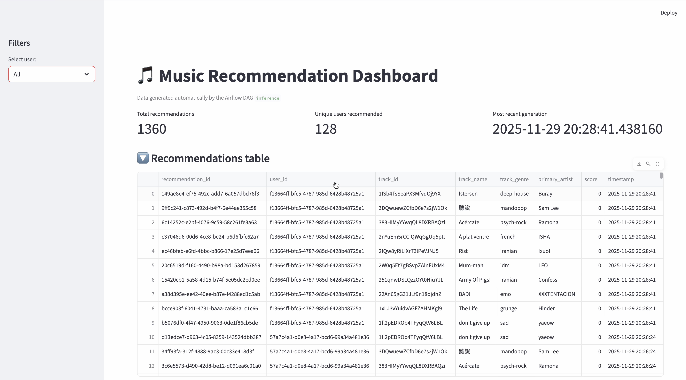

# DE-Final-Project-Sparkify

# Sparkify Music Recommendation Pipeline  
A full end-to-end data engineering + machine learning system that ingests track metadata, generates synthetic user listening activity, builds a content-based recommendation model, runs scheduled Airflow DAGs to update embeddings and recommendations, and serves results to a Streamlit dashboard.

## Project Overview  
This project builds a production-style music recommendation pipeline that combines:

- **Kaggle track dataset**  
- **Synthetic users + listening event generator**  
- **Content-based recommendation model**  
- **Postgres warehouse**  
- **Airflow orchestration**  
- **Streamlit dashboard**  
- **Automated tests + CI/CD**

The goal is to simulate the infrastructure of a real music analytics platform (“Sparkify”) where new listening activity and track data continuously flow through an ETL + ML pipeline, producing fresh recommendations for every user.

## Introduction / Exploratory Data Analysis (EDA)  
EDA notebooks (`00_eda.ipynb` and `03_eda.ipynb`) explore the structure and quality of the raw Kaggle track dataset.

**Highlights from the EDA:**
- Visualized distribution of genres, artists, and track metadata.  
- Inspected numeric audio features such as:
  - energy  
  - valence  
  - danceability  
  - loudness  
  - speechiness  
  - acousticness  
- Investigated correlations between features and potential data leakage.  
- Identified missing values, inconsistent types, and outliers.  
- Confirmed suitability of audio features for content-based similarity modeling.

The EDA step establishes which features are reliable inputs to the recommendation model.

## Data Cleaning  
The cleaning notebook (`02_clean_data.ipynb`) transforms the raw dataset into a modeling-ready format.

**Key cleaning steps:**
- Dropping unused or redundant columns.  
- Filling or removing missing numeric feature values.  
- Ensuring each track has a unique `track_id`.  
- Normalizing audio features for later vector-based similarity computation.  
- Validating column types and ensuring genre/artist consistency.  
- Exporting cleaned data to CSV for loading into Postgres.

The cleaned dataset becomes the starting point for downstream Airflow DAGs.

## DAG #1 — Ingestion & Embeddings  
The first Airflow DAG (`ingestion_embeddings.py`) is responsible for refreshing model inputs and outputs on a daily schedule.

### **DAG Responsibilities**
1. **Load raw tables**  
   - Pull `tracks`, `users`, and `listening_events` from Postgres.

2. **Build Track Embedding Matrix**  
   - Uses `build_track_matrix()` from `recommendation_model.py`.  
   - Standardizes feature columns.  
   - Saves an (n_tracks × n_features) embedding matrix back to Postgres.

3. **Generate User Vectors**  
   - For each user, aggregate their listening history.  
   - Convert to a numerical vector using `generate_user_vector()`.

4. **Compute User Recommendations**  
   - Compute cosine similarity between the user vector and all track embeddings.  
   - Exclude previously listened tracks.  
   - Write Top-N recommendations to the `user_recommendations` table.

5. **Validation**  
   - Validate schema integrity.  
   - Ensure no null or duplicate IDs.  
   - Confirm embedding shapes.  
   - Verify that every user receives recommendations.

### **Output Tables**
- `track_embeddings`  
- `user_vectors`  
- `user_recommendations`

This DAG is the core of the ML pipeline.

## DAG #2 — Inference  
The second DAG or script (`inference.py`) supports **on-demand recommendations**.

### **Functions**
- Loads the latest track embeddings and user listening events.  
- Accepts a specific `user_id`.  
- Runs:
  - vector construction  
  - similarity scoring  
  - Top-N ranking  
- Returns recommendations in a JSON-friendly structure.

This inference layer is used directly by the dashboard and can be triggered programmatically.

## Dashboard (Streamlit)  
`streamlit_app.py` provides an interactive front-end to explore recommendations.

### **Features**
- Dropdown sidebar to select a user.  
- Real-time query to the inference script.  
- Table of:
  - recommended tracks  
  - similarity scores  
  - relevant metadata  
- Auto-refresh for live updates.  
- Uses Postgres + dotenv for environment configuration.

The dashboard demonstrates how analysts or product managers would consume the pipeline’s output.

# Dashboard Visualizations  

The Streamlit dashboard provides an interactive interface for exploring recommendations generated by the Airflow pipelines. It surfaces several insights about **global listening trends**, **individual user behavior**, and the **final recommendation outputs** stored in Postgres. These visualizations demonstrate how model outputs are consumed and interpreted by analysts or product managers.

---

## 🎤 Top Primary Artists (All Users & Per User)

This chart summarizes the **most frequently listened-to primary artists across all synthetic users**.  
It aggregates listening events and counts how many times each artist appears as the primary artist for a played track.

**What this view shows:**

- Global popularity patterns across the entire user base  
- Which artists dominate listening behavior  
- How synthetic users behave relative to real-world expectations  
- Whether listening patterns are balanced or skewed toward certain artists  

Below the global chart is a **per-user version** that shows the top primary artists for a selected user. This makes it easy to compare:

- Individual user preferences  
- Alignment (or misalignment) with global popularity  
- How personalized the recommendation engine must be to serve each user  

---

## Genre Distribution (Per User)

This visualization shows the **genre distribution for a selected user**, based on their listening history.  
Each bar represents how many tracks from each genre the user has consumed.

**What this view shows:**

- Dominant genres in the user's listening behavior  
- Whether users have diverse or concentrated music tastes  
- How genre preferences influence user embeddings  
- Which genres are likely to shape future recommendations  

Genre-level insights help validate that the recommendation engine produces results consistent with user preferences.

---

## Top Track Names (All Users)

Also shown in the second screenshot is a chart of the **Top Track Names across all users**.  
This represents the most frequently played tracks in the synthetic dataset.

**What this view shows:**

- Global track-level popularity  
- Whether tracks correlate with top artists and genres  
- Skew or imbalance in listening behaviors  
- How track popularity may affect recommendation scoring  

This helps provide context for why certain tracks appear frequently in recommendations.

---

## Full Recommendations Table

The dashboard includes a **Recommendations Table** that displays the results of the Airflow `inference` DAG.  
This table is a direct view of the `user_recommendations` table stored in Postgres and refreshed automatically.

Each row includes:

- `recommendation_id` — unique identifier  
- `user_id` — user receiving the recommendation  
- `track_id` — recommended track  
- `track_name` — name of the track  
- `track_genre` — genre of the track  
- `primary_artist` — primary associated artist  
- `score` — cosine similarity score  
- `timestamp` — when the recommendation was generated  

**Why this table matters:**

- Validates that the recommendation engine is producing outputs on schedule  
- Shows the total number of recommendations and unique users served  
- Provides the timestamp of the most recent Airflow run  
- Allows inspection of recommendation quality and diversity  

This table represents the final stage of the pipeline—where embedded features, user vectors, and similarity-based ranking become actionable recommendations.

---

## Testing  
The `tests/` directory includes unit, integration, and end-to-end tests, executed via GitHub Actions.

### **Test Coverage**
- **Synthetic data generator**
  - Correct number of users
  - Correct listening event structure
  - Valid columns and types

- **Recommendation model logic**
  - Track feature matrix creation  
  - User vector construction  
  - Multi-genre handling  
  - Cosine similarity sorting

- **End-to-end pipeline**
  - Small synthetic dataset flows through:  
    tracks → embeddings → user vector → recommendations

- **CI/CD workflow**
  - Automatic tests run on pull requests  
  - Failures block merges

Testing ensures correctness and stability as the project evolves.

## Limitations & Future Work  

### **Current Limitations**
- The recommendation model is purely content-based and does not incorporate:
  - collaborative filtering  
  - temporal patterns  
  - user session behaviors  
- Synthetic listening data may not fully represent real-world behavior.  
- No deduplication or advanced validation yet in Airflow DAGs.  
- Inference is synchronous and not optimized for large user populations.  
- Feature engineering does not yet include embeddings learned from deep models.

### **Future Improvements**
- Integrate **collaborative filtering** or **hybrid models**.  
- Add real-time streaming ingestion with Kafka/Kinesis.  
- Expand synthetic generator to simulate:
  - session length  
  - skip behavior  
  - popularity biases  
- Replace basic cosine similarity with:
  - neural embeddings  
  - metric learning  
  - autoencoder-based track representations  
- Add caching and asynchronous inference for scalability.
